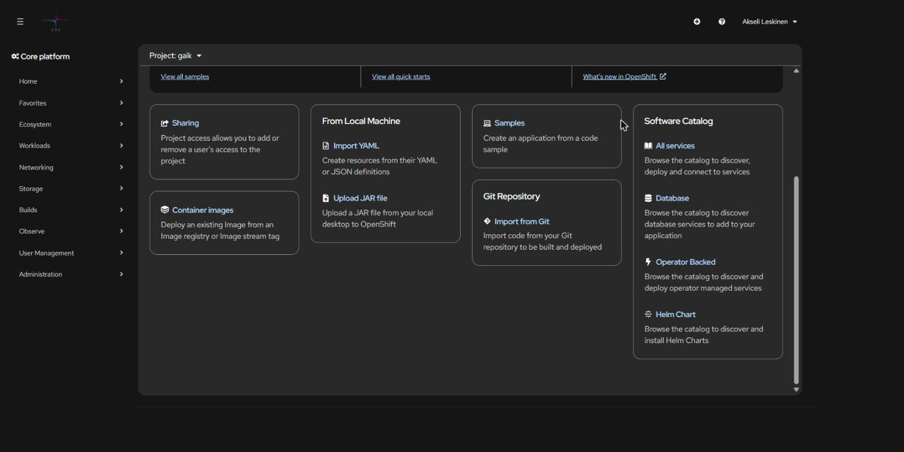

# CSC Rahti 2 -käsikirja

Käytännön ohjeet sovellusten julkaisuun **CSC:n Rahti 2 -konttipilvessä** (OpenShift/OKD) —
selaimesta, komentoriviltä ja tekoälyagentin avulla. Mukana neljä valmista
**agenttiskilliä**, jotka opettavat Claude Coden ja muut koodausagentit käyttämään CSC:n
ympäristöjä oikein.

🇬🇧 [English version](en/README.md) · 📚 [CSC:n virallinen dokumentaatio](https://docs.csc.fi/cloud/rahti/)

---

## 🚀 Pikaopas

Sovellus pystyyn viidessä komennossa (edellyttää, että Rahti-oikeus on kunnossa ja `oc`
sekä Docker on asennettu):

```bash
# 1. Kirjaudu — konsolista: nimesi → Copy login command
oc login https://api.2.rahti.csc.fi:6443 --token=sha256~<tokenisi>

# 2. Rakenna image (amd64, myös Apple Siliconilla)
docker build --platform linux/amd64 -t sovellukseni .

# 3. Kirjaudu Rahdin rekisteriin ja luo ImageStream
docker login -u unused -p $(oc whoami -t) image-registry.apps.2.rahti.csc.fi
oc create imagestream sovellukseni

# 4. Tagaa ja työnnä
docker tag sovellukseni image-registry.apps.2.rahti.csc.fi/<projekti>/sovellukseni:latest
docker push image-registry.apps.2.rahti.csc.fi/<projekti>/sovellukseni:latest

# 5. Julkaise ja avaa julkinen HTTPS-osoite
oc new-app --image-stream=sovellukseni
oc create route edge --service=sovellukseni --insecure-policy=Redirect
oc get route sovellukseni -o jsonpath='{.spec.host}{"\n"}'
```

Ensimmäistä kertaa liikkeellä? Aloita luvusta [1. Aloitus](docs/fi/01-aloitus.md).



---

## 📖 Sisällys

| # | Luku | Sisältö |
| --- | --- | --- |
| 1 | [**Aloitus**](docs/fi/01-aloitus.md) | Pääsy, MFA-kirjautuminen, projektit, `oc`-työkalu, service account, kiintiöt, tietoturvarajoitukset |
| 2 | [**Sovelluksen julkaisu**](docs/fi/02-julkaisu.md) | Imagen rakennus, rekisterit (Rahti / Satama / Docker Hub), julkaisu selaimesta ja manifesteilla, image trigger, deploy-skripti |
| 3 | [**GitHub-integraatio**](docs/fi/03-github-integraatio.md) | BuildConfig, SSH-avaimet, webhookit, "URL is valid but cannot be reached" -kiertotie, main vs. master |
| 4 | [**Reitit ja verkko**](docs/fi/04-reitit-ja-verkko.md) | Service-DNS, Routet, oma URL, TLS, 504-timeout, IP-rajaus, oma verkkotunnus |
| 5 | [**Ympäristömuuttujat**](docs/fi/05-ymparistomuuttujat.md) | Build-aika vs. ajonaika, Secretit, ConfigMapit, kierrätys, sudenkuopat |
| 6 | [**Frontend ja backend**](docs/fi/06-frontend-ja-backend.md) | React (Vite) + Node.js kolmella tavalla, CORS, terveystarkistukset, portit |
| 7 | [**Tietokanta**](docs/fi/07-tietokanta.md) | PostgreSQL + pgvector, pysyvä levy, pgAdmin port-forwardilla, varmuuskopiot |
| 8 | [**Allas S3**](docs/fi/08-allas-s3.md) | Objektitallennus, S3-tunnusten haku, boto3 ja AWS SDK, path-style-pakko |
| 9 | [**Vianmääritys**](docs/fi/09-vianmaaritys.md) | CrashLoopBackOff, ImagePullBackOff, OOMKilled, 504, "deploy ei päivity", väärät hälytykset |
| 10 | [**Agenttinen kehitys**](docs/fi/10-agenttinen-kehitys.md) | Skillien asennus ja käyttö, UI vs. CLI vs. agentti, turvasäännöt |

---

## 🤖 Agenttiskillit

Repositoriossa on neljä skilliä kansiossa [`.claude/skills/`](.claude/skills/). Ne ovat
tavallista markdownia: ei asennettavaa ohjelmistoa, ei API-avainta.

| Skilli | Mihin | Tila |
| --- | --- | --- |
| [`csc-rahti`](.claude/skills/csc-rahti/) | Rahti-deployaus, imaget, routet, salaisuudet, Satama-rekisteri, Allas, Aitta-LLM-API | luku + kirjoitus |
| [`rahti-audit`](.claude/skills/rahti-audit/) | Koko namespacen tilannekuva yhdellä ajolla | **read-only** |
| [`csc-roihu`](.claude/skills/csc-roihu/) | Roihu-supertietokone: Slurm, GH200-GPU:t | luku + kirjoitus |
| [`csc-lumi`](.claude/skills/csc-lumi/) | LUMI: AMD MI250X, ROCm | luku + kirjoitus |

**Käyttöönotto kolmella tavalla:**

```bash
# 1. Kloonaa repo — Claude Code lukee .claude/skills/ automaattisesti
git clone <repon-url> && cd csc-rahti-guide && claude

# 2. Kopioi henkilökohtaiseen käyttöön kaikkiin projekteihin
cp -r .claude/skills/csc-rahti ~/.claude/skills/

# 3. Jaettu .agents/skills-polku muille agenttityökaluille (Claude Code ei lue sitä)
ln -s ~/.claude/skills/csc-rahti ~/.agents/skills/csc-rahti
```

Windowsin ohjeet ja tarkemmat perustelut: [10. Agenttinen kehitys](docs/fi/10-agenttinen-kehitys.md).

Käyttö:

```
/csc-rahti Tee sovellukselle route osoitteeseen demo.2.rahtiapp.fi
Tarkista onko Rahdissa mitään rikki
```

> **Agentti ei läpäise CSC:n MFA:ta.** Kirjaudu itse `oc login` -komennolla ennen kuin
> annat agentille tehtävän — tai käytä service accountia
> ([ohje](docs/fi/01-aloitus.md#service-account-pitkäkestoiseen-käyttöön)).

---

## 🗂️ Repositorion rakenne

```
.
├── README.md                  ← olet tässä
├── en/README.md               English version
├── docs/
│   ├── fi/                    suomenkieliset luvut 1–10
│   ├── en/                    English chapters 1–10
│   └── images/                kuvakaappaukset Rahti-konsolista
└── .claude/skills/
    ├── csc-rahti/             SKILL.md + references/ + scripts/ + tests/
    ├── rahti-audit/
    ├── csc-roihu/
    └── csc-lumi/
```

---

## 🔗 Keskeiset osoitteet

| Palvelu | Osoite |
| --- | --- |
| Rahti-konsoli | <https://console.rahti.csc.fi> |
| Rahti API | `https://api.2.rahti.csc.fi:6443` |
| Konttirekisteri | `image-registry.apps.2.rahti.csc.fi` |
| Sovellusten osoitteet | `*.2.rahtiapp.fi` |
| Satama (Harbor) | <https://satama.csc.fi> |
| Allas | <https://allas.csc.fi> |
| MyCSC (projektit ja oikeudet) | <https://my.csc.fi> |
| CSC:n dokumentaatio | <https://docs.csc.fi/cloud/rahti/> |
| Palvelupiste | servicedesk@csc.fi |

---

## 🛠️ Repositorion työkalut

```bash
pnpm install
pnpm run check:links     # tarkistaa jokaisen sisäisen linkin ja ankkurin
pnpm run test:skills     # ajaa csc-rahti-skillin PowerShell-testit
pnpm run format          # prettier

node scripts/build-pdf.mjs        # tulostettava PDF molemmilla kielillä → build/
node scripts/build-pdf.mjs fi     # vain suomeksi
```

PDF:t rakennetaan tarvittaessa eikä niitä versioida — muuten ne vanhenevat heti kun
jotain lukua muokataan. PDF-generointi vaatii paikallisen Chromen tai Edgen
(`CHROME_PATH`-ympäristömuuttujalla voi osoittaa muualle).

---

## ℹ️ Tietoja

Tämä on **yhteisöohje**, ei CSC:n virallinen dokumentaatio. Ristiriitatilanteessa
[docs.csc.fi](https://docs.csc.fi/cloud/rahti/) on aina oikeassa.

Kuvakaappaukset on otettu Rahti 2 -konsolista elokuussa 2026. Konsolin ulkoasu muuttuu
ajoittain — jos ohje ja näkymä eroavat, seuraa valikkojen nimiä, älä pikselejä.

Korjaukset ja täydennykset ovat tervetulleita issueina ja pull requesteina.

Lisenssi: [MIT](LICENSE).
