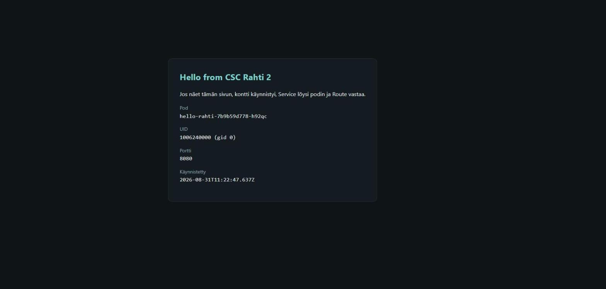

# CSC Rahti 2 -käsikirja

> Sovellusten julkaisu **CSC:n Rahti 2 -konttipilveen** (OpenShift/OKD) kolmella tavalla:
> selaimesta, komentoriviltä ja tekoälyagentin avulla. Mukana neljä agenttiskilliä, jotka
> opettavat Claude Coden, Copilotin, Cursorin tai Codexin käyttämään CSC:n ympäristöjä
> oikein — ja testattu esimerkkisovellus, jonka saa pystyyn viidessä minuutissa.

🇬🇧 [In English](en/README.md) &nbsp;·&nbsp;
📄 [Opas PDF:nä](docs/pdf/csc-rahti-opas-fi.pdf) &nbsp;·&nbsp;
📚 [CSC:n virallinen dokumentaatio](https://docs.csc.fi/cloud/rahti/)

---

## Mistä aloittaa

| Haluat… | Mene tänne |
| --- | --- |
| nähdä jonkin toimivan heti | [Viisi minuuttia](#viisi-minuuttia) alla |
| ymmärtää mitä teet | [Luku 1: Aloitus](docs/fi/01-aloitus.md) |
| tehdä sen selaimessa | [Luku 2: Julkaise selaimesta](docs/fi/02-julkaisu.md#3-julkaise-selaimesta) |
| korjata rikkinäisen sovelluksen | [Luku 9: Vianmääritys](docs/fi/09-vianmaaritys.md) |
| antaa agentin tehdä työn | [Luku 10: Agenttinen kehitys](docs/fi/10-agenttinen-kehitys.md) |
| jakaa ohjeen eteenpäin | [PDF suomeksi](docs/pdf/csc-rahti-opas-fi.pdf) · [englanniksi](docs/pdf/csc-rahti-guide-en.pdf) |

---

## Viisi minuuttia

Repossa on [`examples/hello-rahti`](examples/hello-rahti/) — riippuvuudeton
esimerkkisovellus, joka täyttää kaikki Rahdin vaatimukset. **Nämä komennot on ajettu
läpi sellaisenaan Rahti 2:ssa**, joten ne toimivat.

```bash
git clone https://github.com/laguagu/csc-rahti-guide
cd csc-rahti-guide/examples/hello-rahti

# 1. Kirjaudu — konsolista: nimesi → Copy login command
oc login https://api.2.rahti.csc.fi:6443 --token=sha256~<tokenisi>
oc project <projektisi>

# 2. ImageStream ENNEN pushia, muuten push kaatuu HTTP 500:aan
oc create imagestream hello-rahti

# 3. Rakenna ja työnnä
docker build --platform linux/amd64 -t hello-rahti .
docker login -u unused -p $(oc whoami -t) image-registry.apps.2.rahti.csc.fi
docker tag  hello-rahti image-registry.apps.2.rahti.csc.fi/<projektisi>/hello-rahti:latest
docker push image-registry.apps.2.rahti.csc.fi/<projektisi>/hello-rahti:latest

# 4. Deployment, Service ja julkinen HTTPS-osoite
oc new-app --image-stream=hello-rahti
oc expose deployment/hello-rahti --port=8080
oc create route edge hello-rahti --service=hello-rahti --insecure-policy=Redirect

# 5. Osoite ja testi
oc get route hello-rahti -o jsonpath='{.spec.host}{"\n"}'
```



Sovellus näyttää podin nimen ja sille arvotun UID:n — siis todistaa, että kontti
käynnistyi, Service löysi podin ja Route vastaa. Siivoa lopuksi:

```bash
oc delete route/hello-rahti svc/hello-rahti deployment/hello-rahti is/hello-rahti
```

> **Vaihe 4 on se, joka kaataa useimmat ohjeet.** `oc new-app` luo pelkän Deploymentin,
> ei Serviceä. Ilman `oc expose`-riviä reitin luonti epäonnistuu virheeseen *"you need to
> provide a route port via --port when exposing a non-existent service"*.

---

## Sisällys

| # | Luku | Sisältö |
| --- | --- | --- |
| 1 | [Aloitus](docs/fi/01-aloitus.md) | Pääsy ja MFA, projektit, `oc`-työkalu, service account, kiintiöt, tietoturvarajoitukset, milloin **ei** Rahti |
| 2 | [Sovelluksen julkaisu](docs/fi/02-julkaisu.md) | Imagen rakennus, rekisterit (Rahti / Satama / Docker Hub), julkaisu selaimesta ja manifesteilla, image trigger, deploy-skripti |
| 3 | [GitHub-integraatio](docs/fi/03-github-integraatio.md) | BuildConfig, SSH-avaimet, webhookit, tunnettu SSH-bugi, `main` vs. `master` |
| 4 | [Reitit ja verkko](docs/fi/04-reitit-ja-verkko.md) | Service-DNS, Routet, oma URL, TLS, 504-timeout, IP-rajaus, oma verkkotunnus |
| 5 | [Ympäristömuuttujat](docs/fi/05-ymparistomuuttujat.md) | Build-aika vs. ajonaika, Secretit, ConfigMapit, kierrätys, sudenkuopat |
| 6 | [Frontend ja backend](docs/fi/06-frontend-ja-backend.md) | React (Vite) + Node.js kolmella tavalla, CORS, terveystarkistukset, portit |
| 7 | [Tietokanta](docs/fi/07-tietokanta.md) | PostgreSQL + pgvector, pysyvä levy, pgAdmin, varmuuskopiot |
| 8 | [Allas S3](docs/fi/08-allas-s3.md) | Objektitallennus, S3-tunnukset, boto3 ja AWS SDK, path-style-pakko |
| 9 | [Vianmääritys](docs/fi/09-vianmaaritys.md) | CrashLoopBackOff, ImagePullBackOff, OOMKilled, 504, "deploy ei päivity", väärät hälytykset |
| 10 | [Agenttinen kehitys](docs/fi/10-agenttinen-kehitys.md) | Skillien asennus ja käyttö, UI vs. CLI vs. agentti, turvasäännöt |

---

## Agenttiskillit

[Skilli](https://support.claude.com/en/articles/12512176-what-are-skills) on
markdown-tiedosto, joka kertoo tekoälyagentille miten jokin asia tehdään oikein. Ei
asennettavaa ohjelmistoa, ei API-avainta — ja sama tiedosto käy Claudelle, Copilotille,
Cursorille ja Codexille.

| Skilli | Mihin | Tila |
| --- | --- | --- |
| [`csc-rahti`](.claude/skills/csc-rahti/) | Rahti-deployaus, imaget, routet, salaisuudet, **Satama**-rekisteri, **Allas**, **Aitta**-LLM-API | luku + kirjoitus |
| [`rahti-audit`](.claude/skills/rahti-audit/) | Koko namespacen tilannekuva yhdellä ajolla | **read-only** |
| [`csc-roihu`](.claude/skills/csc-roihu/) | Roihu-supertietokone: Slurm, GH200-GPU:t, omat LLM-mallit | luku + kirjoitus |
| [`csc-lumi`](.claude/skills/csc-lumi/) | LUMI: AMD MI250X, ROCm | luku + kirjoitus |

```bash
# Kloonaa repo — Claude Code lukee .claude/skills/ automaattisesti
git clone https://github.com/laguagu/csc-rahti-guide && cd csc-rahti-guide && claude

# TAI kopioi omaan käyttöön kaikkiin projekteihin
cp -r .claude/skills/csc-rahti ~/.claude/skills/
```

Sitten kuvaile tehtävä tavallisella kielellä:

```
Deployaa tämä Next.js-sovellus Rahtiin projektiin minun-projekti, portti 3000
Tarkista onko Rahdissa mitään rikki
Sovellus palauttaa 504 kun kysely kestää yli puoli minuuttia — korjaa
```

> **Agentti ei läpäise CSC:n MFA:ta.** Kirjaudu itse `oc login` -komennolla ensin, tai
> käytä [service accountia](docs/fi/01-aloitus.md#service-account-pitkäkestoiseen-käyttöön),
> jonka token kestää valitsemasi ajan.

Asennus muille agenteille, skillien synkronointi koneiden välillä ja turvasäännöt:
[luku 10](docs/fi/10-agenttinen-kehitys.md).

---

## Mitä repossa on

```
README.md · en/README.md      etusivut suomeksi ja englanniksi
docs/fi/ · docs/en/           luvut 1–10 molemmilla kielillä
docs/pdf/                     samat oppaat PDF:nä jaettavaksi
docs/images/                  kuvakaappaukset Rahti-konsolista
examples/hello-rahti/         testattu esimerkkisovellus
.claude/skills/               neljä agenttiskilliä
scripts/                      linkkitarkistus ja PDF-generointi
```

---

## Keskeiset osoitteet

| Palvelu | Osoite |
| --- | --- |
| Rahti-konsoli | <https://console.rahti.csc.fi> |
| Rahti API | `https://api.2.rahti.csc.fi:6443` |
| Konttirekisteri | `image-registry.apps.2.rahti.csc.fi` |
| Sovellusten osoitteet | `*.2.rahtiapp.fi` |
| Satama (konttirekisteri, Harbor) | <https://satama.csc.fi/harbor/projects> |
| Allas (objektitallennus) | <https://allas.csc.fi> |
| Aitta (LLM-rajapinta) | <https://aitta.csc.fi> |
| MyCSC (projektit ja oikeudet) | <https://my.csc.fi> |
| CSC:n dokumentaatio | <https://docs.csc.fi/cloud/rahti/> |
| Palvelupiste | servicedesk@csc.fi |

---

## Kehittäjälle

```bash
pnpm install
pnpm run check:links     # tarkistaa jokaisen sisäisen linkin ja ankkurin
pnpm run test:skills     # ajaa csc-rahti-skillin PowerShell-testit
pnpm run build:pdf       # rakentaa docs/pdf/-oppaat uudelleen
```

PDF:t rakennetaan Chromella tai Edgellä (`CHROME_PATH` ohittaa polun) ja ne
committoidaan, jotta ohjeen voi jakaa yhtenä tiedostona. Aja `build:pdf` uudelleen aina
kun muokkaat lukuja.

---

## Tietoja

Tämä on **yhteisöohje**, ei CSC:n virallinen dokumentaatio. Ristiriitatilanteessa
[docs.csc.fi](https://docs.csc.fi/cloud/rahti/) on oikeassa.

Kuvakaappaukset on otettu Rahti 2 -konsolista elokuussa 2026 ja komennot ajettu läpi
oikeassa ympäristössä. Konsolin ulkoasu muuttuu ajoittain — jos ohje ja näkymä eroavat,
seuraa valikkojen nimiä, älä pikselejä.

Korjaukset ja täydennykset ovat tervetulleita issueina ja pull requesteina.
Lisenssi: [MIT](LICENSE). Haaga-Helian tunnus PDF:ien kansilehdellä on Haaga-Helia
ammattikorkeakoulun omaisuutta.
