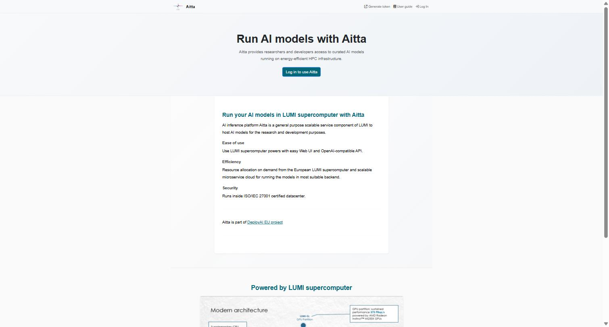
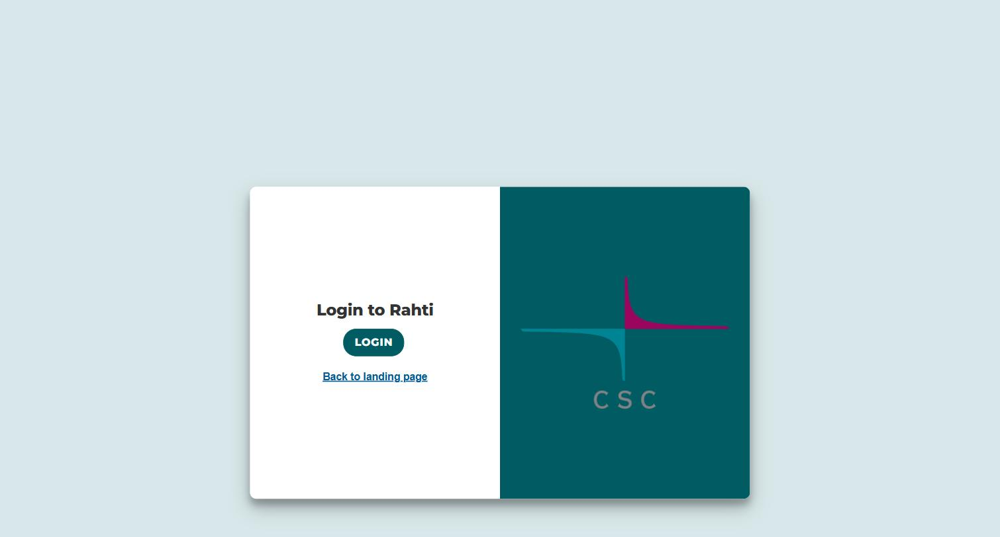
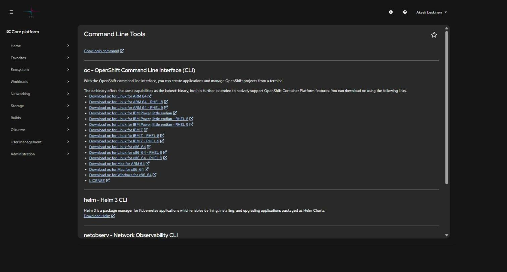
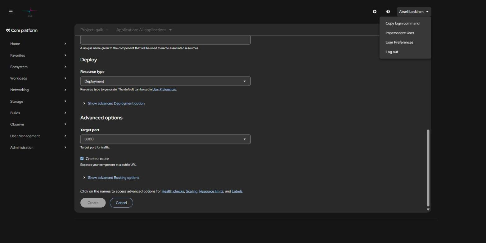
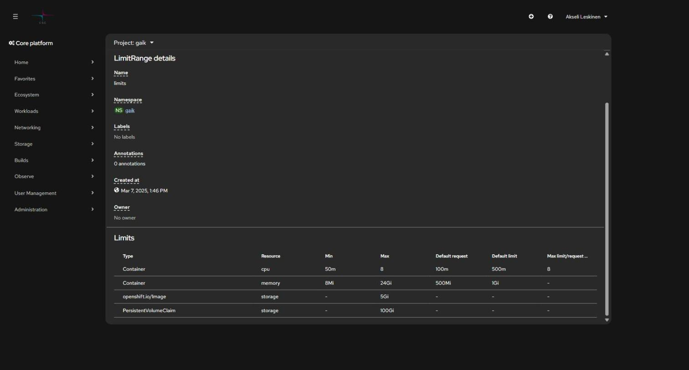

# 1. Getting started: access, login, and projects

> What Rahti is, how to get access, how to log in from the browser and the command
> line, and what resources your project can use.

## Contents

- [What Rahti 2 is](#what-rahti-2-is)
  - [What if Rahti isn't the right fit?](#what-if-rahti-isnt-the-right-fit)
  - [CSC's other services on the same project](#cscs-other-services-on-the-same-project)
- [Prerequisites](#prerequisites)
- [Logging in from the browser](#logging-in-from-the-browser)
- [Creating a project](#creating-a-project)
- [The `oc` command-line tool](#the-oc-command-line-tool)
- [Logging in from the command line](#logging-in-from-the-command-line)
- [Service account for long-term use](#service-account-for-long-term-use)
- [Quotas and resource limits](#quotas-and-resource-limits)
- [Security restrictions](#security-restrictions)

## What Rahti 2 is

Rahti 2 is CSC's container cloud. It runs on **OKD**, the open-source community
edition of Red Hat OpenShift. In practice: you write a Dockerfile, push the image to a
registry, and Rahti runs it as a pod, gives it a public HTTPS address, and restarts it
if it crashes.

| Rahti is a good fit for | Rahti is not a good fit for |
| --- | --- |
| Web apps and APIs | GPU computing and model training → [Roihu](https://docs.csc.fi/computing/systems-roihu/) or [LUMI](https://docs.lumi-supercomputer.eu/) |
| Always-on services | Batch jobs and Slurm jobs → Roihu |
| Microservices and background services | Managing virtual machines → [cPouta](https://docs.csc.fi/cloud/pouta/) |
| Demos and teaching | Containers that need root privileges (not possible, see below) |

### What if Rahti isn't the right fit?

Rahti is free for a CSC project and keeps data in Finland, which is hard to beat for
teaching use. It isn't always the fastest route to everything, though:

| Platform | When it beats Rahti | Watch out for |
| --- | --- | --- |
| [Vercel](https://vercel.com/docs) | A Next.js/React frontend, preview URLs on every PR, edge functions | The free tier doesn't allow commercial use; data is in the US by default |
| [Render](https://render.com/docs) | A backend service + managed Postgres without Kubernetes | Free-tier services sleep when idle |
| [Railway](https://docs.railway.com/) | The fastest "repo in, URL out" for experiments | Usage-based pricing can catch you out |
| [Hetzner](https://docs.hetzner.com/) or [cPouta](https://docs.csc.fi/cloud/pouta/) | You need your own VM, a GPU, or root privileges | Maintenance, updates, and security are on you |

In practice, the same Dockerfile works on all of these — the difference is who
handles the configuration. On Rahti you write the Kubernetes objects yourself; on
Vercel and Railway the platform guesses them for you. For teaching purposes, Rahti
teaches more, because the objects stay visible.

A common combination in student projects is a frontend on Vercel with a heavier
backend + database on Rahti: you get a public demo URL easily, while the data and
models stay on CSC's side.

**Key addresses:**

| What | Address |
| --- | --- |
| Web console | `https://console.rahti.csc.fi` |
| API server | `https://api.2.rahti.csc.fi:6443` |
| Internal container registry | `image-registry.apps.2.rahti.csc.fi` |
| App URL space | `*.2.rahtiapp.fi` |
| Egress IP (for firewall rules) | `86.50.229.150` — can change, always check the [documentation](https://docs.csc.fi/cloud/rahti/configurations/egress-ip/) |

### CSC's other services on the same project

Rahti access opens the door to CSC's other services on the same computing project.
These often turn up in the same application:

| Service | For | Guide |
| --- | --- | --- |
| **Satama** | Container registry (Harbor), sharing images across projects, vulnerability scanning | [chapter 2](02-deploying.md#option-b-satama-cscs-harbor) |
| **Allas** | Object storage over S3, large files and backups | [chapter 8](08-allas-s3.md) |
| **Aitta** | Ready-made language and embedding models behind an OpenAI-compatible API | [csc-rahti skill](../../.claude/skills/csc-rahti/references/aitta-llm-api.md) |
| **Roihu** | NVIDIA GH200 GPUs, model training and batch jobs | [csc-roihu skill](../../.claude/skills/csc-roihu/) |
| **LUMI** | AMD MI250X, EuroHPC allocation | [csc-lumi skill](../../.claude/skills/csc-lumi/) |

**Aitta** is particularly handy for teaching: you get language and embedding models
behind an API without your own GPU and without a commercial API key. The models run on
the LUMI supercomputer and the API is OpenAI-compatible, so existing code works by
changing `baseURL`.



```python
from openai import OpenAI

client = OpenAI(
    base_url="https://aitta-api.csc.fi/openai",   # AITTA_API_BASE
    api_key="<AITTA_API_TOKEN>",                   # token: https://aitta-auth.csc.fi
)
```

The catalogue includes Llama 3.3, gpt-oss, Gemma 3, Qwen3-VL, embedding models and the
Finnish **Poro 2**. Most models are "offline", meaning they have to be woken with
`POST /model/{id}/preload` before the first chat completion.

## Prerequisites

1. **A CSC user account** — created at [MyCSC](https://my.csc.fi/).
2. **A computing project with Rahti enabled:**
   - Log in at [my.csc.fi](https://my.csc.fi) → *My Projects*
   - Select your project → open **Rahti** in the service list → accept the terms of
     use → *Apply for access*
   - CSC confirms the application. Permission sync can take about 10 minutes.
3. **Docker or Podman** locally, if you build images yourself.
4. **The `oc` command-line tool**, if you don't want to do everything in the browser.

Installing the tools, briefly:

| Tool | Windows | macOS | Linux |
| --- | --- | --- | --- |
| Docker | [Docker Desktop](https://docs.docker.com/desktop/install/windows-install/) or `winget install Docker.DockerDesktop` | [Docker Desktop](https://docs.docker.com/desktop/install/mac-install/) or `brew install --cask docker` | `sudo apt install docker.io` + `sudo usermod -aG docker $USER` |
| Podman (lighter alternative) | `winget install RedHat.Podman` | `brew install podman` | `sudo apt install podman` |
| `oc` | `scoop install openshift-cli` | `brew install openshift-cli` | download from the [console](https://console.rahti.csc.fi/command-line-tools) |

Check that both answer:

```bash
docker --version     # or: podman --version
oc version --client
```

> Podman runs containers without root privileges, which is closer to how Rahti runs
> them. The commands are the same: replace `docker` with `podman`.

> The same computing project can also be used with cPouta or Roihu — Rahti is simply
> added to its list of available services.

## Logging in from the browser

Go to <https://console.rahti.csc.fi> and click **LOGIN**.



Choose an authentication method: **Haka** (higher education institutions), **Virtu**
(government), or **CSC**. All of them require multi-factor authentication (MFA) —
mandatory from November 25, 2025. MFA cannot be bypassed with a script or an AI agent.

> **"User not found" after logging in?** The account exists, but the computing project
> hasn't been granted Rahti access yet, or the sync is still in progress. Check MyCSC.

## Creating a project

In Rahti, everything runs inside a **project** (a Kubernetes *namespace*). A project
has its own network, its own secrets, and its own access list.

**In the browser:** left menu → *Home → Projects* → **Create Project**.

**From the command line** — note the `csc_project` description, which links the Rahti
project to the computing project and thus to billing:

```bash
oc new-project my-project --description="csc_project: 2001234"
```

By default, all members of the computing project get admin rights on the created Rahti
project. Individual users can be added in the console under
*User Management → RoleBindings*.

> **Naming:** the project name appears in the app's default address in the form
> `<app>-<project>.2.rahtiapp.fi`, so pick something short and clear.

## The `oc` command-line tool

`oc` is the OpenShift CLI. It can do everything `kubectl` can, plus OKD-specific things
(routes, image streams, build configs).

Download the binary directly from the console: **? menu → Command Line Tools**.



On Windows, the easiest way is a package manager:

```powershell
# Scoop
scoop install openshift-cli

# or download the zip from the page above and extract oc.exe into a folder on your PATH
```

Check the installation:

```bash
oc version --client
```

## Logging in from the command line

1. In the console, click your name in the top-right corner → **Copy login command**

   

2. On the page that opens, click **Display Token**
3. Copy the command and run it in your terminal:

```bash
oc login https://api.2.rahti.csc.fi:6443 --token=sha256~<your-token>
```

Login is machine-specific and shared across all terminal windows.
**A personal token expires after about a day.**

Check who you are and which project you're in:

```bash
oc whoami                  # username, or system:serviceaccount:<ns>:<name>
oc project                 # current project
oc projects                # all projects you have access to
oc project my-project      # switch project
```

## Service account for long-term use

A personal token expires every day, which is inconvenient for CI pipelines, deploy
scripts, and AI agents. The solution is a **service account**: it has no MFA, and you
can choose the lifetime of its token yourself.

```bash
# 1. Create an account in the project
oc create serviceaccount deployer-bot -n my-project

# 2. Grant it a role (view = read, edit = deploy, admin = also manage permissions)
oc adm policy add-role-to-user edit \
  system:serviceaccount:my-project:deployer-bot -n my-project

# 3. Request a token — a year, in this case
oc create token deployer-bot -n my-project --duration=8760h
```

Store the token in a secrets manager or a gitignored env file — **never commit it**.
Usage:

```bash
oc login https://api.2.rahti.csc.fi:6443 --token=<service-account-token>
```

Revoking it is just as quick:

```bash
oc adm policy remove-role-from-user edit \
  system:serviceaccount:my-project:deployer-bot -n my-project
oc delete serviceaccount deployer-bot -n my-project
```

> Use a different account for each purpose. For just pushing images, the
> `system:image-pusher` role is enough — you don't need `edit`.
>
> This repository's [csc-rahti skill](../../.claude/skills/csc-rahti/) includes
> PowerShell scripts (`Initialize-RahtiCredential.ps1`, `Connect-Rahti.ps1`) that
> automate the whole lifecycle and store the token outside the repository.

## Quotas and resource limits

A quota is **per computing project and shared across all of its Rahti projects** — not
per app. Default quota for a new computing project:

| Resource | Default |
| --- | --- |
| vCPUs | 4 |
| Memory | 16 GiB |
| Storage (PVC) | 100 GiB |
| Ephemeral storage | 5 GiB |
| Number of image streams | 20 |
| Concurrent pods | 100 |
| Number of PVCs | 20 |

```bash
oc describe AppliedClusterResourceQuotas   # usage for the whole computing project
oc describe limitranges -n <namespace>     # limits for an individual container
```

The defaults land on the pod even if the Deployment doesn't request anything:

```bash
oc get pod <pod> -o jsonpath='{.spec.containers[0].resources}'
# {"limits":{"cpu":"500m","memory":"1Gi"},"requests":{"cpu":"100m","memory":"500Mi"}}
```

**LimitRange** determines what an individual container is allowed to request — and
what it gets if you don't request anything:



| Type | CPU | Memory |
| --- | --- | --- |
| `requests` (reserved) | 100m | 500Mi |
| `limits` (ceiling) | 500m | 1Gi |

In addition: the `limits`/`requests` ratio can be at most 5, a single image can be at
most 5 GiB, and a single PVC at most 100 GiB. In the screenshot above, the project has
been granted limits higher than the default — **always check your own project's actual
values**, don't assume.

Additional quota is requested case by case from the
[CSC service desk](mailto:servicedesk@csc.fi).

## Security restrictions

Rahti is a shared, multi-tenant environment, so containers are restricted:

- **Root is not allowed.** A container that requires `USER root` will not start.
- **Random UID.** A container gets a project-specific UID at startup. This guide's
  test app got `1006240000`, even though its Dockerfile says `USER 1001`. So don't
  write a `runAsUser` value in the manifest, and don't assume a UID. **The group is
  always `0`** — that's what the write-permission solution relies on.
- **Restricted-v2 policy:** `allowPrivilegeEscalation` must not be `true`, all
  capabilities must be dropped (`capabilities.drop: ALL`, with the exception of
  `NET_BIND_SERVICE`), and `seccompProfile` must be either empty or `RuntimeDefault`.
- **Privileged mode is blocked.**

The practical consequence for your Dockerfile: make writable directories writable by
group 0. See [9. Troubleshooting](09-troubleshooting.md#permission-denied-when-writing-a-file)
and the skill's [Dockerfile examples](../../.claude/skills/csc-rahti/references/dockerfile-examples.md).

---

**Next:** [2. Deploying an application →](02-deploying.md)
