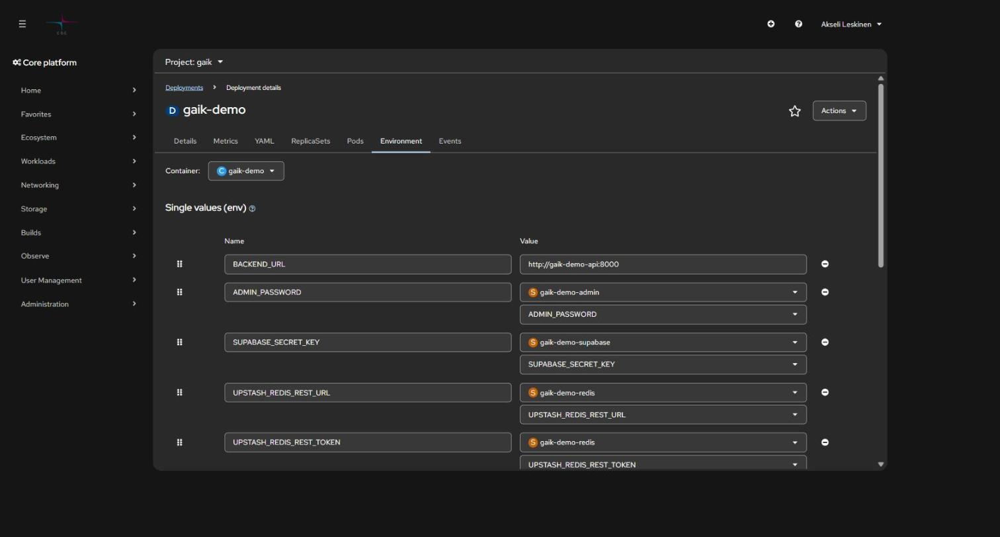
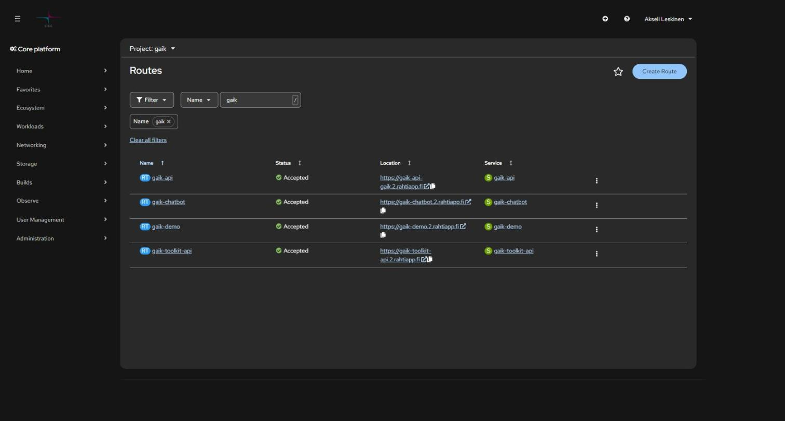

# 4. Routes, networking, and URLs

> How an app gets a public address, how services talk to each other inside the
> cluster, and what to do when a long request cuts off after 30 seconds.

## Contents

- [Three layers: Pod, Service, Route](#three-layers-pod-service-route)
- [Internal traffic: Service DNS](#internal-traffic-service-dns)
- [Public address: Route](#public-address-route)
- [Creating your own URL](#creating-your-own-url)
- [Switching routes without downtime](#switching-routes-without-downtime)
- [TLS termination](#tls-termination)
- [504 Gateway Time-out on long requests](#504-gateway-time-out-on-long-requests)
- [IP restriction and other annotations](#ip-restriction-and-other-annotations)
- [Custom domain](#custom-domain)
- [Egress traffic](#egress-traffic)

## Three layers: Pod, Service, Route

```
Internet ──► Route (https://app.2.rahtiapp.fi)
                │  TLS is terminated here (edge)
                ▼
             Service (app:3000)        ← stable DNS name and load balancing
                │
                ▼
             Pod, Pod, Pod             ← IPs change, pods die and get created
```

- **A pod's IP changes** every time the pod restarts. Never rely on it for anything.
- **Service** is a stable name and IP that routes traffic based on a label selector.
- **Route** is the only thing visible to the internet. Without a Route, a service is
  only reachable from inside the cluster — which is the **right** choice for a backend
  or a database.

By default, a pod can only talk to pods in its own project (NetworkPolicy).

## Internal traffic: Service DNS

Every Service gets a DNS name:

```
<service>.<project>.svc.cluster.local     # full name
<service>.<project>                       # from a different project
<service>                                 # from within the same project
```

In practice, the frontend calls the backend like this:

```bash
oc set env deployment/frontend -n <project> \
  BACKEND_URL=http://backend-api:8000
```



Note `http://`, not `https://` — TLS is already terminated at the Route, and the
internal network carries traffic inside the cluster. The port is the **Service** port,
not the Route's.

Testing the connection from a pod:

```bash
oc exec -it deployment/frontend -n <project> -- sh
# inside the pod:
wget -qO- http://backend-api:8000/health
```

> **Best practice:** don't give the backend a Route at all. That way it can't be
> called from the internet, and you don't have to build authentication twice.

More patterns: [6. Frontend and backend](06-frontend-and-backend.md).

## Public address: Route

When you create an app from the console and check *Create a route*, Rahti generates an
address in the form:

```
https://<component-name>-<project>.2.rahtiapp.fi
```



In the screenshot, `gaik-api` uses the generated name (`gaik-api-gaik.2.rahtiapp.fi`)
while the others use a custom one (`gaik-demo.2.rahtiapp.fi`). Both work side by side.

```bash
oc get routes -n <project>
oc get route <name> -n <project> -o jsonpath='{.spec.host}'
```

## Creating your own URL

The address prefix is **unique across the entire Rahti environment**, and the suffix
must be `.2.rahtiapp.fi`. A route is its own object, so you get a new address by
creating a new Route — you don't need to delete the old one.

```yaml
# new-route.yaml
apiVersion: route.openshift.io/v1
kind: Route
metadata:
  name: <route-name>
  namespace: <project>
  labels:
    app: <app-name>
  annotations:
    openshift.io/host.generated: "false"
spec:
  host: <desired-name>.2.rahtiapp.fi
  to:
    kind: Service
    name: <service-name>
    weight: 100
  port:
    targetPort: <port-name-or-number>
  tls:
    termination: edge
    insecureEdgeTerminationPolicy: Redirect
  wildcardPolicy: None
```

```bash
oc project                       # confirm the project
oc apply -f new-route.yaml
curl -I https://<desired-name>.2.rahtiapp.fi
```

**Example.** An app called `learning-assistant`, whose Service is `learning-assistant` on
port 3000:

```yaml
spec:
  host: learning-assistant.2.rahtiapp.fi
  to:
    kind: Service
    name: learning-assistant
  port:
    targetPort: 3000-tcp
```

> `targetPort` refers to the **Service**'s port. For services created from the
> console, the port name is typically `<number>-tcp`. Check with:
> `oc get svc <name> -o yaml`.

The same thing with a single command, no YAML file needed:

```bash
oc create route edge <route-name> \
  --service=<service> --hostname=<name>.2.rahtiapp.fi \
  --insecure-policy=Redirect -n <project>
```

## Switching routes without downtime

Multiple Routes can point to the same Service. Do the migration like this:

1. Create a new Route with the new hostname
2. Test it
3. Update links and any CORS settings
4. Remove the old one only once nothing uses it anymore

```bash
oc delete route <old-route> -n <project>
```

## TLS termination

| Mode | What happens | When |
| --- | --- | --- |
| **edge** | The router terminates TLS and forwards HTTP to the pod | Default. The app doesn't need to know about certificates. |
| **passthrough** | The router doesn't terminate anything; the pod handles TLS | End-to-end encryption, your own certificate in the pod |
| **reencrypt** | The router terminates and re-encrypts to the pod | The internal network must also be encrypted, but Rahti's certificate is used externally |

For `*.2.rahtiapp.fi` addresses, Rahti's wildcard certificate is enough — you don't need
to get your own. **A Route without a `tls` block is served as plain HTTP**, so edge
termination has to be requested explicitly.

## 504 Gateway Time-out on long requests

The Route's HAProxy timeout defaults to **30 seconds**. A long synchronous request — an
LLM call, a large file upload, a heavy report — cuts off with a 504 error, which the app
often shows as a generic "Request failed" message.

```bash
oc annotate route <route> \
  haproxy.router.openshift.io/timeout=120s -n <project> --overwrite
```

Or in the manifest:

```yaml
metadata:
  annotations:
    haproxy.router.openshift.io/timeout: 120s
```

First make sure the request actually takes that long — **a 504 at almost exactly ~30
seconds** is the telltale sign of this issue:

```bash
curl -o /dev/null -s -w 'HTTP %{http_code} in %{time_total}s\n' https://<address>/slow
```

For genuinely long-running jobs, an asynchronous job plus status polling is a better
solution than keeping a connection open for minutes at a time.

## IP restriction and other annotations

```bash
# Allow only the higher-education network
oc annotate route <route> \
  haproxy.router.openshift.io/ip_allowlist='193.166.0.0/16' -n <project>

# HSTS (force HTTPS in the browser)
oc annotate route <route> \
  haproxy.router.openshift.io/hsts_header="max-age=31536000;includeSubDomains;preload" -n <project>
```

> **Warning:** an invalid allowlist value is silently rejected and **all traffic is
> allowed**. Values are separated by spaces, not commas, and there must be no trailing
> whitespace.

## Custom domain

You can use your own domain by pointing DNS at Rahti's router:

```
CNAME  <your-domain>  →  router-default.apps.2.rahti.csc.fi
```

If a CNAME isn't possible (a root domain), use an A record with that name's IP — but
remember the IP can change. The certificate is your own responsibility; Let's Encrypt
automation works with Rahti's cert-manager support. Instructions:
[CSC: Custom domains](https://docs.csc.fi/cloud/rahti/configurations/custom-domain/).

## Egress traffic

All traffic currently leaving Rahti uses the IP address `86.50.229.150`. You'll need it
if an external database or API is behind a firewall.

CSC warns that the address can change, and parallel Rahti versions running side by side
have different addresses. Don't hardcode it without a plan for updating it — always
check the value in the
[documentation](https://docs.csc.fi/cloud/rahti/configurations/egress-ip/). A
dedicated, project-specific egress IP can be requested from the service desk.

---

**Previous:** [3. GitHub integration](03-github-integration.md) · **Next:** [5. Environment variables and secrets →](05-environment-variables.md)

**Sources:** [CSC: Networking in Rahti](https://docs.csc.fi/cloud/rahti/usage/networking/) ·
[CSC: Security guide](https://docs.csc.fi/cloud/rahti/security-guide/)
