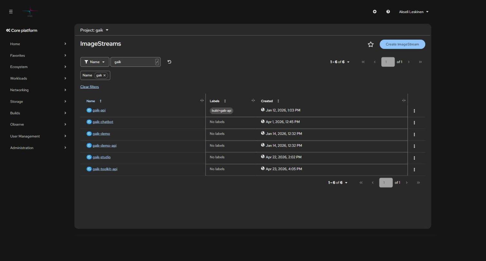
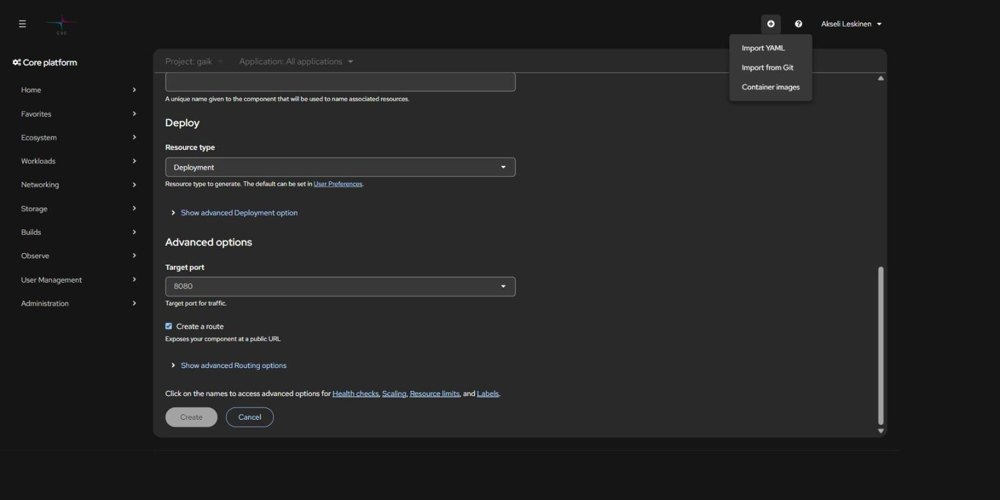
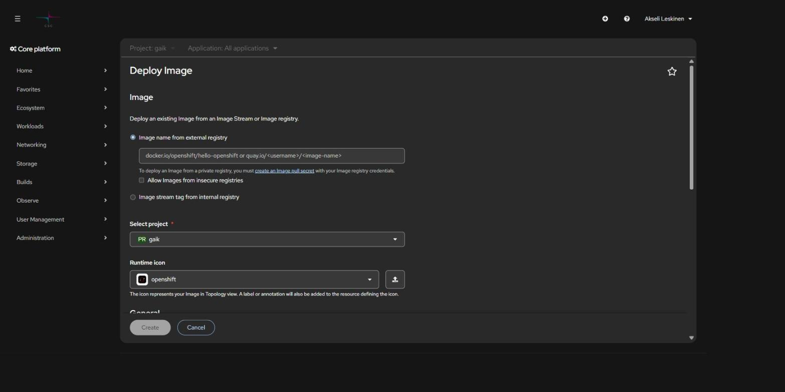
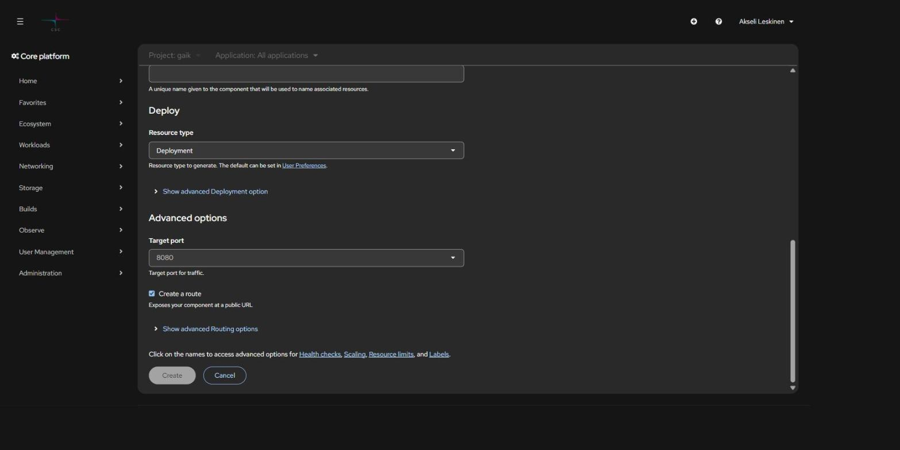
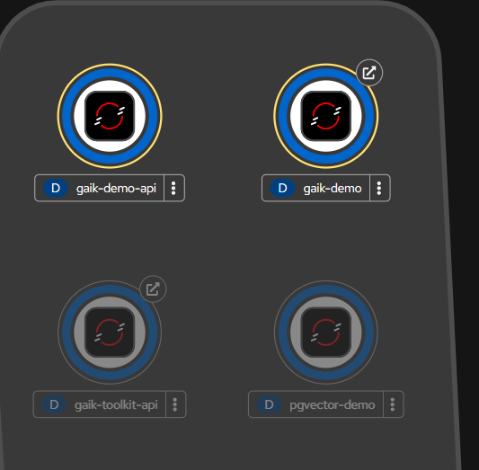

# 2. Sovelluksen julkaisu Dockerilla

> Imagen rakennus, työntäminen rekisteriin ja sovelluksen käynnistys Rahdissa — sekä
> selaimesta että komentoriviltä.

## Sisällys

- [Kokonaiskuva](#kokonaiskuva)
- [1. Rakenna image](#1-rakenna-image)
- [2. Valitse rekisteri](#2-valitse-rekisteri)
  - [Vaihtoehto A: Rahdin sisäinen rekisteri](#vaihtoehto-a-rahdin-sisäinen-rekisteri)
  - [Vaihtoehto B: Satama (CSC:n Harbor)](#vaihtoehto-b-satama-cscn-harbor)
  - [Vaihtoehto C: Docker Hub](#vaihtoehto-c-docker-hub)
- [3. Julkaise selaimesta](#3-julkaise-selaimesta)
- [4. Julkaise komentoriviltä (manifestit)](#4-julkaise-komentoriviltä-manifestit)
- [Automaattinen uudelleenkäynnistys uudesta imagesta](#automaattinen-uudelleenkäynnistys-uudesta-imagesta)
- [Toistuva deploy-skripti](#toistuva-deploy-skripti)
- [Binary build vaihtoehtona](#binary-build-vaihtoehtona)

## Kokonaiskuva

```
  Dockerfile ──► docker build ──► docker push ──► ImageStream ──► Deployment ──► Pod
                                                                       │
                                                          Service ─────┘
                                                             │
                                                          Route ──► https://…2.rahtiapp.fi
```

Neljä objektia riittää lähes aina:

| Objekti | Tehtävä |
| --- | --- |
| **ImageStream** | Rahdin sisäinen viittaus imageen ja sen tageihin |
| **Deployment** | Pitää halutun määrän podeja pystyssä, hoitaa rullaavan päivityksen |
| **Service** | Pysyvä sisäinen osoite podeille (DNS-nimi + kuormantasaus) |
| **Route** | Julkinen HTTPS-osoite, joka osoittaa Serviceen |

## 1. Rakenna image

```bash
# Peruskomento projektin juuressa
docker build -t sovellukseni .

# Ilman välimuistia, jos epäilet vanhentunutta kerrosta
docker build --no-cache -t sovellukseni .
```

Testaa paikallisesti ennen kuin viet pilveen:

```bash
docker run -p 3000:3000 sovellukseni
docker run --env-file .env -p 3000:3000 sovellukseni
```

> **Rahti-yhteensopiva Dockerfile:** älä aja roottina, älä kovakoodaa UID:tä ja tee
> kirjoitettavista hakemistoista ryhmän 0 kirjoitettavia. Valmiit pohjat
> (Next.js, Python/FastAPI, staattinen sivusto) löytyvät skillin
> [dockerfile-examples.md](../../.claude/skills/csc-rahti/references/dockerfile-examples.md)-tiedostosta.

> **Prosessorarkkitehtuuri:** Rahti ajaa `linux/amd64`. Applen M-sarjan koneella
> rakennettu image on oletuksena `arm64` eikä käynnisty Rahdissa. Käytä
> `docker build --platform linux/amd64 …`.

## 2. Valitse rekisteri

| Rekisteri | Milloin |
| --- | --- |
| **Rahdin sisäinen** `image-registry.apps.2.rahti.csc.fi` | Nopea kehityssykli yhden projektin sisällä. Oletusvalinta. |
| **Satama** `satama.csc.fi` | Image jaetaan projektien tai klustereiden välillä, tai tarvitaan haavoittuvuusskannaus, allekirjoitus ja pitkäikäiset robottitunnukset. |
| **Docker Hub** | Julkinen image, tai ei CSC-projektia mukana lainkaan. |

### Vaihtoehto A: Rahdin sisäinen rekisteri

```bash
# 1. Kirjaudu rekisteriin (vaatii voimassa olevan oc-session)
docker login -u unused -p $(oc whoami -t) image-registry.apps.2.rahti.csc.fi

# 2. Tagaa
docker tag sovellukseni \
  image-registry.apps.2.rahti.csc.fi/<projekti>/sovellukseni:latest

# 3. Työnnä
docker push image-registry.apps.2.rahti.csc.fi/<projekti>/sovellukseni:latest
```

**ImageStreamin on oltava olemassa ennen työntämistä**, muuten push kaatuu HTTP 500
-virheeseen:

```bash
oc get is -n <projekti>                        # listaa olemassa olevat
oc create imagestream sovellukseni -n <projekti>
```



> **Oikotie ensimmäisellä kerralla:** työnnä image ensin Docker Hubiin ja julkaise se
> Rahdissa sieltä. Rahti luo ImageStreamin automaattisesti, minkä jälkeen voit siirtyä
> sisäiseen rekisteriin.

CI-putkeen kannattaa tehdä oma tunnus, jolla on vain työntöoikeus:

```bash
oc create serviceaccount pusher -n <projekti>
oc policy add-role-to-user system:image-pusher -z pusher -n <projekti>
docker login -u unused -p $(oc create token pusher --duration=8760h) \
  image-registry.apps.2.rahti.csc.fi
```

### Vaihtoehto B: Satama (CSC:n Harbor)

Satama on CSC:n oma konttirekisteri, erillinen palvelu Rahdista. Kirjautuminen tapahtuu
**CLI-salaisuudella** (Satama-käyttöliittymä → käyttäjänimi → *User Profile* → *CLI
Secret*), ei MyCSC-salasanalla.

```bash
docker login satama.csc.fi -u <csc-tunnus>      # liitä CLI secret
docker tag  sovellukseni:1.0 satama.csc.fi/<satama-projekti>/sovellukseni:1.0
docker push satama.csc.fi/<satama-projekti>/sovellukseni:1.0
```

Yksityisestä Satama-projektista vetäminen vaatii pull secretin:

```bash
oc create secret docker-registry satama-pull \
  --docker-server=satama.csc.fi \
  --docker-username='robot$<projekti>+<nimi>' \
  --docker-password="$SATAMA_ROBOT_SECRET" -n <projekti>
oc secrets link default satama-pull --for=pull -n <projekti>
```

Julkisista Satama-projekteista vedetään ilman salaisuutta. Robottitunnukset, skannaus,
tagien muuttumattomuus ja kiintiöt:
[satama-registry.md](../../.claude/skills/csc-rahti/references/satama-registry.md).

### Vaihtoehto C: Docker Hub

```bash
docker tag sovellukseni <dockerhub-tunnus>/sovellukseni:latest
docker push <dockerhub-tunnus>/sovellukseni:latest
```

Yksityinen Docker Hub -image vaatii Rahdissa *Image pull secretin* (registry `docker.io`,
käyttäjätunnus ja salasana/token). Julkiselle imagelle ei tarvita mitään.

## 3. Julkaise selaimesta

Konsolin vasen valikko on nykyään yhtenäinen **Core platform** -navigaatio; erillistä
Developer/Administrator-näkymän vaihtoa ei enää ole. Uusi sovellus lisätään joko
ylhäältä **+**-pikavalikosta tai projektin **+Add**-sivulta.


Nopein reitti: **+** (ylhäällä) → *Container images*.



**Deploy Image -lomake:**



- **Image name from external registry** — kirjoita esim. `käyttäjä/sovellus:latest`
  (Docker Hub) tai `satama.csc.fi/projekti/sovellus:1.0`
- **Image stream tag from internal registry** — valitse aiemmin työnnetty image
- **Select project** — kohdeprojekti
- **Application** — looginen ryhmä, johon komponentti kuuluu (näkyy Topology-näkymässä)
- **Name** — komponentin nimi, josta johdetaan Deployment, Service ja Route

Vieritä alas **Advanced options** -osioon:



- **Target port** — portti, jota sovelluksesi kuuntelee (esim. 3000 tai 8080)
- **Create a route** — luo julkisen HTTPS-osoitteen. Jätä pois, jos palvelu saa olla
  vain sisäinen (esim. backend tai tietokanta).

Paina **Create**. Rahti luo Deploymentin, Servicen ja mahdollisen Routen, generoi
osoitteen `<nimi>-<projekti>.2.rahtiapp.fi` ja hoitaa TLS:n (edge-terminointi, HTTP
ohjataan HTTPS:ään).

Julkaisun jälkeen sovellus näkyy **Topology**-näkymässä ryhmiteltynä sovelluksittain:



## 4. Julkaise komentoriviltä (manifestit)

Kun sovellus deployataan toistuvasti, selainlomake alkaa haitata: konfiguraatio ei ole
versionhallinnassa. Suositeltu rakenne:

```
<repo>/openshift/
  manifests/            # deklaratiiviset objektit — aja `oc apply -f` KERRAN
    00-imagestreams.yaml
    10-api-deployment.yaml   11-api-service.yaml
    20-web-deployment.yaml   21-web-service.yaml   22-web-route.yaml
  deploy.sh             # toistuva silmukka: build → push → rollout
```

- **Kerran:** `oc apply -f openshift/manifests/` ja salaisuudet
  `oc create secret generic … --from-literal=…`
- **Joka koodimuutoksella:** `./openshift/deploy.sh`

Minimaalinen Deployment + Service + Route:

```yaml
apiVersion: apps/v1
kind: Deployment
metadata:
  name: sovellukseni
spec:
  replicas: 1
  selector:
    matchLabels:
      app: sovellukseni
  template:
    metadata:
      labels:
        app: sovellukseni
    spec:
      securityContext: {}          # EI runAsUser — SCC antaa UID:n
      containers:
        - name: sovellukseni       # nimen on täsmättävä image-triggerin kanssa
          image: image-registry.openshift-image-registry.svc:5000/<projekti>/sovellukseni:latest
          imagePullPolicy: Always
          ports:
            - containerPort: 3000
          resources:
            requests: { cpu: 100m, memory: 256Mi }
            limits:   { cpu: 500m, memory: 512Mi }
          readinessProbe:
            httpGet: { path: /health, port: 3000 }
            initialDelaySeconds: 5
---
apiVersion: v1
kind: Service
metadata:
  name: sovellukseni
spec:
  selector:
    app: sovellukseni
  ports:
    - name: http
      port: 3000
      targetPort: 3000
---
apiVersion: route.openshift.io/v1
kind: Route
metadata:
  name: sovellukseni
spec:
  host: sovellukseni.2.rahtiapp.fi
  to:
    kind: Service
    name: sovellukseni
  port:
    targetPort: http
  tls:
    termination: edge
    insecureEdgeTerminationPolicy: Redirect
```

Huomaa, että klusterin sisällä imageen viitataan osoitteella
`image-registry.openshift-image-registry.svc:5000/...`, ei julkisella
`image-registry.apps.2.rahti.csc.fi`-nimellä.

## Automaattinen uudelleenkäynnistys uudesta imagesta

Pelkkä `docker push` ei käynnistä podia uudelleen. Lisää Deploymentille **image trigger**,
niin uusi `:latest` otetaan käyttöön automaattisesti:

```yaml
metadata:
  annotations:
    image.openshift.io/triggers: |
      [{"from":{"kind":"ImageStreamTag","name":"sovellukseni:latest"},
        "fieldPath":"spec.template.spec.containers[?(@.name==\"sovellukseni\")].image"}]
```

Trigger kirjoittaa `.image`-kentän uudelleen `@sha256`-digestiksi, joten elävässä
objektissa ei näy `:latest`. Se on oikein, ei vika.

Sama komentoriviltä:

```bash
oc set triggers deployment/sovellukseni \
  --from-image=sovellukseni:latest -c sovellukseni -n <projekti>
```

Jos deployment ei päivity pushin jälkeen, katso
[09 Vianmääritys](09-vianmaaritys.md#deployment-ei-päivity-pushin-jälkeen).

## Toistuva deploy-skripti

Käytännössä toimiva `deploy.sh` tekee neljä asiaa:

```bash
#!/usr/bin/env bash
set -euo pipefail

NS=minun-projekti
APP=sovellukseni
REG=image-registry.apps.2.rahti.csc.fi
TAG=$(date +%Y%m%d-%H%M%S)

docker build --platform linux/amd64 -t "$APP" .
docker tag "$APP" "$REG/$NS/$APP:latest"
docker tag "$APP" "$REG/$NS/$APP:$TAG"
docker push "$REG/$NS/$APP:latest"
docker push "$REG/$NS/$APP:$TAG"

# Pakota rullaus myös silloin kun digest ei muuttunut (esim. muuttunut Secret)
oc patch deployment/"$APP" -n "$NS" -p \
  "{\"spec\":{\"template\":{\"metadata\":{\"annotations\":{\"kubectl.kubernetes.io/restartedAt\":\"$(date -Iseconds)\"}}}}}"
oc rollout status deployment/"$APP" -n "$NS" --timeout=180s
```

> **Salaisuudet eivät päivity itsestään.** Muutettu Secret ei näy ajossa olevalle podille
> ennen uudelleenkäynnistystä — siksi `restartedAt`-patch.

## Binary build vaihtoehtona

Jos et halua ajaa Dockeria paikallisesti, Rahti voi rakentaa imagen puolestasi
lähdekoodista:

```bash
# Kerran
oc new-build --name=sovellukseni --binary --strategy=docker \
  --to=sovellukseni:latest -n <projekti>

# Joka buildissa, projektin juuressa
oc start-build sovellukseni --from-dir=. --follow -n <projekti>
```

Tämä on kätevä testaukseen. Jatkuvaan käyttöön suosittelemme GitHub-integraatiota:
[3. GitHub-integraatio →](03-github-integraatio.md)

---

**Edellinen:** [1. Aloitus](01-aloitus.md) · **Seuraava:** [3. GitHub-integraatio →](03-github-integraatio.md)
