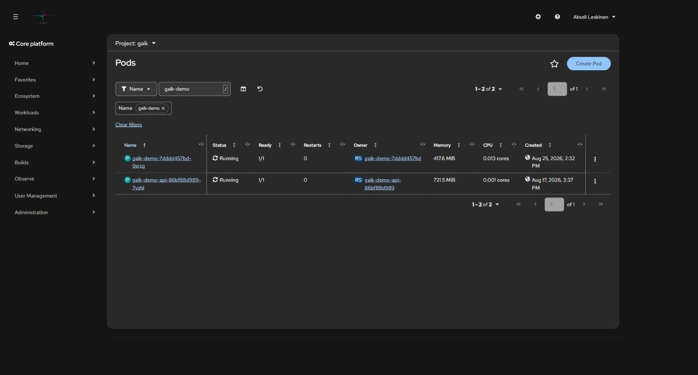
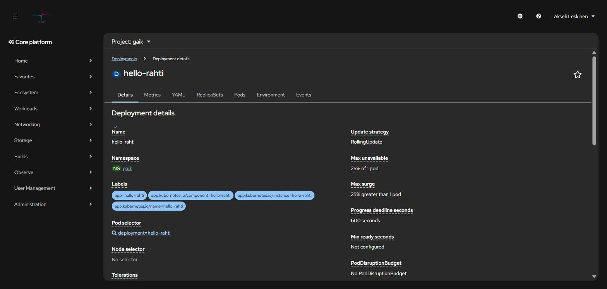

# 9. Vianmääritys

> Oireesta syyhyn. Aloita aina samasta kolmesta komennosta, älä arvaa.

## Sisällys

- [Ensimmäiset kolme komentoa](#ensimmäiset-kolme-komentoa)
- [Podin tilat ja mitä ne tarkoittavat](#podin-tilat-ja-mitä-ne-tarkoittavat)
- [Deployment ei päivity pushin jälkeen](#deployment-ei-päivity-pushin-jälkeen)
- [CrashLoopBackOff](#crashloopbackoff)
- [ImagePullBackOff / ErrImagePull](#imagepullbackoff--errimagepull)
- [Pod jää Pending-tilaan](#pod-jää-pending-tilaan)
- [OOMKilled (exit 137)](#oomkilled-exit-137)
- [Permission denied tiedostoa kirjoitettaessa](#permission-denied-tiedostoa-kirjoitettaessa)
- [500-virhe docker pushissa](#500-virhe-docker-pushissa)
- [504 Gateway Time-out](#504-gateway-time-out)
- [Sovellus ei vastaa Routen kautta](#sovellus-ei-vastaa-routen-kautta)
- [Unauthorized / kirjautuminen vanhentunut](#unauthorized--kirjautuminen-vanhentunut)
- [Vääriä hälytyksiä](#vääriä-hälytyksiä)
- [Koko namespacen tilannekuva](#koko-namespacen-tilannekuva)

## Ensimmäiset kolme komentoa

```bash
oc get pods -n <projekti>                                    # 1. mikä on tila
oc logs deployment/<sovellus> -n <projekti> --tail=50         # 2. mitä sovellus sanoo
oc get events -n <projekti> --sort-by=.lastTimestamp | tail   # 3. mitä klusteri sanoo
```

Podin tila kertoo, kumpaan suuntaan mennä: `Running` mutta väärä käytös → logit.
`Pending`/`CrashLoop`/`ImagePull` → eventit ja `oc describe`.



Samat tiedot löytyvät konsolista: *Workloads → Pods → \<podi\> → Logs / Events*.

## Podin tilat ja mitä ne tarkoittavat

| Tila | Merkitys | Seuraava komento |
| --- | --- | --- |
| `Running` + `1/1` | Käynnissä ja valmis | — |
| `Running` + `0/1` | Käynnissä, mutta readiness-tarkistus ei mene läpi | `oc describe pod <podi>` |
| `Pending` | Ei skeduloitu — kiintiö, PVC tai resurssipyyntö | `oc describe pod <podi>` |
| `CrashLoopBackOff` | Käynnistyy ja kaatuu toistuvasti | `oc logs <podi> --previous` |
| `ImagePullBackOff` | Imagea ei saada haettua | `oc describe pod <podi>` |
| `Error` / `Completed` | Prosessi päättyi (job, build) | Normaalia jobeille |
| `Terminating` pitkään | Sammutus jumissa | `oc delete pod <podi> --force` |

## Deployment ei päivity pushin jälkeen

Yleisin hämmennyksen aihe: image on työnnetty, mutta vanha koodi pyörii yhä.

```bash
# 1. Tuliko uusi image perille?
oc get is <imagestream> -n <projekti>
oc describe is <imagestream> -n <projekti> | head -30

# 2. Onko image trigger olemassa ja päällä?
oc get deployment <sovellus> -n <projekti> \
  -o jsonpath="{.metadata.annotations.image\.openshift\.io/triggers}"
```

Jos tuloste on tyhjä tai sisältää `"paused":"true"`:

```bash
oc annotate deployment/<sovellus> image.openshift.io/triggers- -n <projekti>
oc set triggers deployment/<sovellus> \
  --from-image=<imagestream>:latest -c <kontti> -n <projekti>
```

Pikakorjaus ilman triggeriä:

```bash
oc rollout restart deployment/<sovellus> -n <projekti>
oc rollout status  deployment/<sovellus> -n <projekti>
```

Tai aseta image käsin:

```bash
LATEST=$(oc get is <imagestream> -n <projekti> \
  -o jsonpath='{.status.tags[0].items[0].dockerImageReference}')
oc set image deployment/<sovellus> <kontti>=${LATEST} -n <projekti>
```

**Tarkista myös buildit**, jos käytät BuildConfigia — epäonnistunut buildi tarkoittaa,
ettei uutta imagea koskaan syntynyt:

```bash
oc get builds -n <projekti>
```

## CrashLoopBackOff

```bash
oc logs deployment/<sovellus> -n <projekti> --previous   # edellisen yrityksen logi
oc describe pod <podi> -n <projekti>                     # exit code ja eventit
```

Tavallisimmat syyt:

| Syy | Tunnusmerkki |
| --- | --- |
| Puuttuva ympäristömuuttuja | Logissa `undefined`, `KeyError`, `connection string is empty` |
| Sovellus kuuntelee `127.0.0.1`:tä | Käynnistyy normaalisti, mutta terveystarkistus ei vastaa |
| Väärä portti | `containerPort` ≠ sovelluksen portti |
| Root-oikeuksien tarve | `permission denied`, `EACCES`, `mkdir failed` |
| Väärä arkkitehtuuri | `exec format error` → image on arm64, tarvitaan amd64 |
| OOM | Exit code 137 |

## ImagePullBackOff / ErrImagePull

```bash
oc describe pod <podi> -n <projekti> | grep -A5 Events
```

- **Yksityinen rekisteri ilman pull secretiä** → luo secret ja linkitä se:
  ```bash
  oc secrets link default <pull-secret> --for=pull -n <projekti>
  ```
- **Väärä tagi** → tarkista, että tagi on olemassa: `oc get is <nimi> -o yaml`
- **Väärä osoite** → klusterin sisällä
  `image-registry.openshift-image-registry.svc:5000/<projekti>/<image>`, ulkopuolelta
  `image-registry.apps.2.rahti.csc.fi/<projekti>/<image>`

## Pod jää Pending-tilaan

```bash
oc describe pod <podi> -n <projekti> | tail -20
oc describe AppliedClusterResourceQuotas
```

Kolme tyypillistä syytä:

1. **Kiintiö täynnä.** Kiintiö on jaettu koko laskentaprojektin kesken. Sammuta
   tarpeettomat sovellukset tai skaalaa nollaan: `oc scale deployment/<x> --replicas=0`
2. **PVC ei saa levyä.** `oc get pvc -n <projekti>` — jos tila on `Pending`, koko voi
   ylittää kiintiön (max 100 GiB / PVC).
3. **Resurssipyyntö ylittää rajan.** LimitRange määrää maksimit; liian iso `requests`
   hylätään.

## OOMKilled (exit 137)

Kontti ylitti muistirajansa.

```bash
oc adm top pods -n <projekti>
oc set resources deployment/<sovellus> -n <projekti> --limits=memory=2Gi --requests=memory=512Mi
```

Muista suhderajoitus: `limits` saa olla korkeintaan 5× `requests` (tarkista projektisi
LimitRange). Pelkän katon nostaminen ilman varauksen nostoa voi siis hylkääntyä.

## Permission denied tiedostoa kirjoitettaessa

Rahti antaa kontille satunnaisen UID:n, mutta ryhmä on aina **0**. Tee kirjoitettavista
hakemistoista ryhmän 0 kirjoitettavia:

```dockerfile
RUN mkdir -p /app/output && \
    chown -R 1001:0 /app/output && \
    chmod -R g+rwX /app/output
USER 1001
```

Sama koskee `.next`-, `tmp`- ja cache-hakemistoja. Jos sovellus kirjoittaa
juurihakemistoon, ohjaa se kirjoittamaan `/tmp`:hen — se on aina kirjoitettavissa.

**Älä** yritä korjata tätä `runAsUser`-asetuksella manifestissa; SCC hylkää sen.

## 500-virhe docker pushissa

```
unknown: unexpected status from HEAD request to
https://image-registry.apps.2.rahti.csc.fi/v2/<projekti>/<image>/manifests/sha256:… : 500
```

ImageStream puuttuu. Luo se ensin:

```bash
oc create imagestream <image> -n <projekti>
```

Tarkista myös, että olet kirjautunut rekisteriin (`oc whoami -t` -tokenilla) ja että
image on alle 5 GiB.

## 504 Gateway Time-out

HAProxyn oletustimeout on 30 sekuntia. Ks.
[04 Reitit ja verkko](04-reitit-ja-verkko.md#504-gateway-time-out-pitkissä-pyynnöissä).

```bash
oc annotate route <reitti> haproxy.router.openshift.io/timeout=120s -n <projekti> --overwrite
```

## Sovellus ei vastaa Routen kautta

Etene ulkoa sisäänpäin:

```bash
# 1. Onko Route olemassa ja hyväksytty?
oc get route <reitti> -n <projekti>

# 2. Osoittaako se oikeaan palveluun ja porttiin?
oc describe route <reitti> -n <projekti>

# 3. Vastaako Service?
oc get svc <palvelu> -n <projekti> -o wide
oc get endpoints <palvelu> -n <projekti>      # tyhjä = label-valitsin ei osu podeihin

# 4. Vastaako podi suoraan?
oc port-forward deployment/<sovellus> 8080:<portti> -n <projekti>
curl -I http://localhost:8080
```

Tyhjä `endpoints`-lista on erittäin yleinen: Servicen `selector` ei täsmää podin
labeleihin.

**Klassinen tapaus:** `oc new-app` merkitsee podit labelilla `deployment=<nimi>`, ei
`app=<nimi>`. Siksi `oc get pods -l app=<nimi>` palauttaa "No resources found" vaikka podi
on pystyssä, ja käsin kirjoitettu `selector: {app: <nimi>}` jättää Servicen tyhjäksi.
Tarkista todelliset labelit ennen kuin arvaat:

```bash
oc get pods -n <projekti> --show-labels
oc get svc <palvelu> -n <projekti> -o jsonpath='{.spec.selector}'
```



Konsolissa sama näkyy Deploymentin *Details*-välilehdellä kohdassa **Pod selector**.

## Unauthorized / kirjautuminen vanhentunut

```
error: You must be logged in to the server (Unauthorized)
```

Henkilökohtainen token vanhenee noin vuorokaudessa. Tarkista ensin kuka olet:

```bash
oc whoami
oc config current-context
```

Jos konteksti on vaihtunut takaisin henkilötunnukseen vaikka käytössä pitäisi olla
service account, kirjaudu sillä uudelleen. Pysyvä ratkaisu on service account
pitkäikäisellä tokenilla: [1. Aloitus](01-aloitus.md#service-account-pitkäkestoiseen-käyttöön).

## Vääriä hälytyksiä

Nämä näyttävät vioilta mutta eivät ole:

- **Restart-luku ei yksin ole hälytys.** Kuukausia ajanut podi kerää restartteja
  normaalista kierrätyksestä. Suhteuta se podin ikään: 40 restarttia 90 päivässä on eri
  asia kuin 40 restarttia tunnissa.
- **HTTP 401/403 Routella tarkoittaa, että sovellus vastaa.** Se on pystyssä ja vaatii
  kirjautumisen. Vain 5xx, yhteysvirhe ja timeout ovat hälytyksiä.
- **Ensimmäinen pyyntö vähän käytettyyn sovellukseen voi aikakatkaista** (kylmä
  käynnistys). Kokeile toisen kerran ennen kuin merkitset alhaalla olevaksi.
- **`Completed`-tilaiset podit eivät ole vikoja** — ne ovat päättyneitä job-, cronjob- ja
  build-ajoja.
- **Tyhjä `resourcequota`** on normaali: kiintiö on laskentaprojektin tasolla. Käytä
  `oc describe AppliedClusterResourceQuotas`.
- **Elävässä Deploymentissa näkyy `@sha256:…` eikä `:latest`** — image trigger on
  ratkaissut tagin digestiksi. Näin sen kuuluukin toimia.

## Koko namespacen tilannekuva

Kun haluat tietää kerralla, onko kaikki pystyssä:

```bash
oc get all -n <projekti>
oc get events -n <projekti> --field-selector type=Warning --sort-by=.lastTimestamp
```

Tämän repositorion mukana tulee myös **`rahti-audit`-skilli**, joka kerää saman
tilannekuvan yhdellä ajolla (deploymentit, podit, routet HTTP-vasteineen, warning-eventit
ja kiintiöt) ja raportoi vain poikkeamat. Ks.
[10. Agenttinen kehitys](10-agenttinen-kehitys.md).

---

**Edellinen:** [8. Allas S3](08-allas-s3.md) · **Seuraava:** [10. Agenttinen kehitys →](10-agenttinen-kehitys.md)
